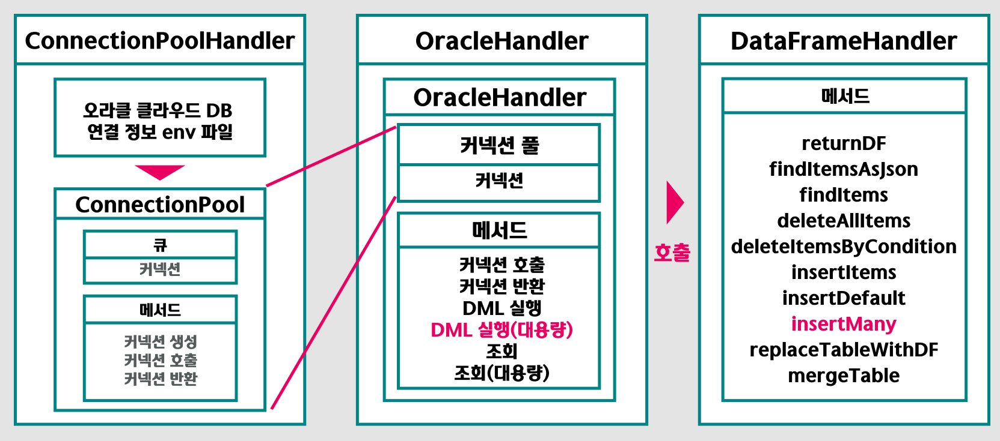

# 하나원클 - AI 기반 주식추천 & 포트폴리오 리밸런싱 서비스

# 1. 프로젝트 개요
## * 프로젝트 배경
 
 
최근 금융사에서 AI를 접목한 상품들이 다수 출시되고 있습니다.  
미래에셋 증권의 종목 읽어주는 AI나 하나증권의 빅데이터랩이 가장 대표적인 예시입니다.  
특히 하나증권은 빅데이터랩에서 멈추지 않고, QuanTec과 협업하여 로보어드바이저 기술과 PB 자산관리서비스를 접목한 하이브리드 자산관리 서비스를 개발중에 있습니다.  
이런 트랜드에 발 맞춰 평소 제가 갖추고 있던 AI 역량을 녹여낼 수 있는 웹프로젝트를 개발하고자 하여 본 프로젝트를 기획했습니다.  
  
## * 프로젝트 목적
하나원클의 목적은 투자자들이 가장많이 하는 고민인 **어떤 종목을 사야하는가, 보유한 종목을 언제 팔아야하는가** 를 정량적인 근거를 바탕으로 제시하는 것을 목표로 합니다.   
**원클 점수**를 산출하여 이를 바탕으로 종목의 현재 가격을 정량화 하여 투자의견과 종목 추천에 사용하며, 전통적 포트폴리오 평가 방식을 통해 포트폴리오를 평가하고 개선 방안을 제시하여 사용자가 큰 어려움 없이 증권서비스를 이용할 수 있도록 돕습니다.  
  

# 2. 프로젝트 제안서

하나원클의 초기 프로젝트 제안 발표 자료입니다.
    
   [제안발표자료](ReadMe_img/2360340022_홍윤기_HANA-ONE클STOCK_프로젝트제안서.pdf) 
하나원클의 초기 프로젝트 수행 계획서입니다.
    
   [수행계획서](ReadMe_img/2360340022_홍윤기_프로젝트수행계획서.pdf) 
    

# 3. 프로젝트 결과
최종 프로젝트 결과입니다.
## * 발표 ppt  
    
   [최종발표자료](ReadMe_img/2360340022_홍윤기_하나원클_발표자료.pdf) 
## * 시연 동영상
   
    
   *사진을 누르시면 영상 유튜브 사이트로 이동합니다
  

# 4. 프로젝트 결과 요약

## * 수행기간
   2023-09-01 ~ 2023-10-10
   
## * 담당업무
   하나원클 프로젝트 설계 및 제작, Front-End/Back-End 개발

## * 주요기능
    

## * 사용기술
    
- Spring-MVC 기반 웹 어플리케이션 개발 
- Django-MTV 기반 웹 어플리케이션 개발 
- Python Pandas DataFrame을 이용한 데이터 관리
- ScikitLearn 라이브러리를 활용한 ML 모델링
- KB-Albert를 사용한 NLP 모델링
- Oracledb executeMany를 이용한 대용량데이터 처리

## * 개발환경
- OS : macOS, Sonoma 14.0, Oracle Linux 
- Framework : SpringBoot, MyBatis, Django, Flask
- Language : Java, Python, Javascript
- IDE Tools : VScode, IntelliJ, Sqldeveloper
- DB : Oracle 19c(Oracle Cloud DB)

## * ERD
    
## * 시스템 아키텍쳐
    
   
## * 서비스 아키텍쳐
    
         
# 5. 응용기술(특화기술)
Python DataFrame 자료구조와 SQL간의 상호 호환을 위한 Python 모듈 패키지 개발  

     

대용량 Insert 성능개선  

     

ML 모델 개발  

     

NLP 모델 개발  

     

    

# 6. 본인 소개

|항목|내용||
|-----|---------------------------|----|
|이름 |홍윤기| |
|연락처 | 이메일 | rain2473(@)naver.com|
|학력사항|졸업(2023.02)|건국대학교 전기전자공학부|
|자격증| 2022.12.12  | SQLD ( 한국데이터산업진흥원 ) |
| | 2023.04.28  | 빅데이터 분석기사(필기)  ( 한국데이터산업진흥원 ) |
|skill set| Language & Tools | Java, C, Python, JavaScript, Spring, Django, Pandas |
| | Database | SQL(Oracle) |
| | ETC | Docker, Scikit-Learn |
|수상경력| 2022.11.04 | 월간 데이콘 KOSPI기반 분석 시각화 경진대회(1위) |
| | 2023.10.13 | 2023학년도 한국폴리텍대학 프로젝트 작품 경진대회 금상 |
| | 2023.11.01 | 2023학년도 폴리텍 벤처창업경진대회 본선진출(동상 확보) |
|교육이력| 2022.08 ~ 2022.10 | KB IT’s Your Life 2기 |
| | 2023.03 ~ 2023.10 | 하나금융티아이 채용전환형 교육 1200시간( 한국폴리텍대학교 광명융합기술교육원 - 데이터분석과 ) |
|어학능력| 2022.09.21  | OPIc(영어) IM1 |
| | 2023.01.12 | JLPT N1 |
